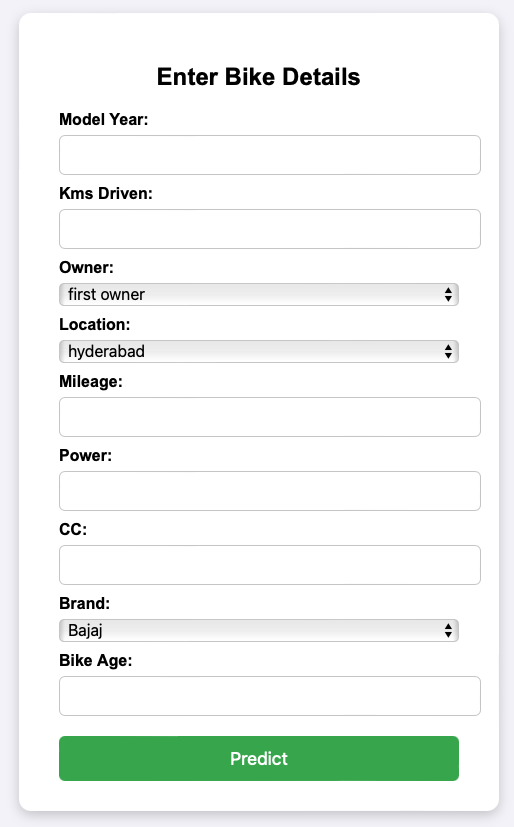

#  Bike Price Prediction  

A Machine Learning web application built with **Flask**, where users can input bike details such as model year, kilometers driven, mileage, power, brand, and more to get a predicted resale price.  

---

##  Overview  
The goal of this project is to help estimate the resale value of a bike based on historical data.  
It combines a **scikit-learn pipeline** with a simple **Flask-based frontend** to provide instant predictions. 

Try it live here: http://35.175.213.64:5000

---

##  Features  
- Predicts bike resale price using a trained **ML pipeline**  
- Clean and interactive **Flask web interface**  
- User-friendly input form for bike details  
- Model trained on real-world bike resale data  

---

##  Project Structure  

---

##  Tech Stack  
- **Python**  
- **Flask**  
- **scikit-learn**  
- **Pandas**  
- **NumPy**  
- **HTML/CSS** (for frontend)  

---

##  How It Works  
1. User enters bike details (year, kms driven, mileage, power, brand, etc.) into the web form.  
2. Flask passes this data into the **scikit-learn pipeline**.  
3. The pipeline preprocesses the input and uses a trained **RandomForestRegressor** to predict resale price.  
4. The predicted price is displayed on the webpage.  

---

##  Screenshot  

---

## 👨 Author  
- **Puneet Rajpoot**  
- GitHub: [Puneet1223](https://github.com/Puneet1223)  

---
